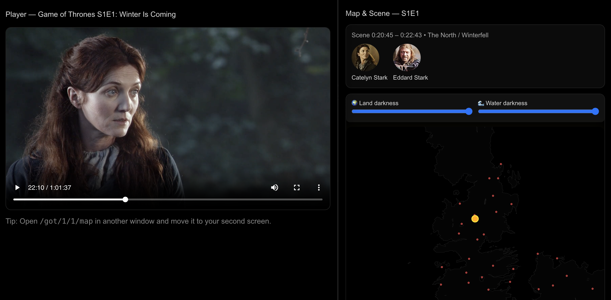

# 🐉 Game of Thrones — Dual-Screen Companion

> ⚔️ A synchronized, interactive companion experience for every *Game of Thrones* episode — watch the show on one screen while exploring live maps, locations, and character movements on another.

---

## 🩸 Demo Screenshot

*(Add your screenshot or GIF here)*



---
## 🎬 Overview

This project transforms your *Game of Thrones* rewatch into a cinematic, data-driven experience.
It syncs **episode playback** with **scene metadata** from the [Game of Thrones Dataset by Jeffrey Lancaster](https://github.com/jeffreylancaster/game-of-thrones) to display:

* 🌍 Real-time **map tracking** of locations and sublocations
* 🧙 Character appearances (with portraits & house info)
* ⏱ Scene start / end / duration
* 🖥️ Optional split-screen or dual-device experience

You can run the **Player** on one display (TV or monitor) and the **Map Companion** on another (laptop, tablet, etc.) — both remain perfectly synchronized using the browser’s localStorage API.

---

## 🧩 Features

| Feature                      | Description                                                             |
| ---------------------------- | ----------------------------------------------------------------------- |
| 🗺️ **Dynamic Map**          | TopoJSON map of Westeros & Essos with glowing location markers          |
| 🌑 **Dark Mode**             | Adjustable sliders to control land & water darkness for night viewing   |
| 🎥 **Video Synchronization** | Real-time sync between Player and Map using `localStorage`              |
| 👑 **Character Visuals**     | Display of all characters in current scene, with photo and role         |
| ⚡ **Dual-Screen Ready**      | Player (`/player`) and Map (`/map`) can run in separate tabs or devices |
| 🔥 **Smooth Transitions**    | Map auto-centers and animates as the story moves between scenes         |

---

## 🚀 Getting Started

IMPORTANT: FOR THIS TO WORK, YOU MUST PLACE .MP4 VIDEOS IN YOUR `got-companion/public/videos` FOLDER IN THIS FORMAT: `s01e01.mp4`

### 1. Clone the repo

```bash
git clone https://github.com/<your-username>/got-companion.git
cd got-companion
```

### 2. Install dependencies

```bash
npm install
# or
yarn install
```

### 3. Run the dev server

```bash
npm run dev
```

Open:

* 🎬 **Player:** [http://localhost:3000/got/1/1/player](http://localhost:3000/got/1/1/player)
* 🗺️ **Map:** [http://localhost:3000/got/1/1/map](http://localhost:3000/got/1/1/map)

Play the episode — your map will update in real-time!

---

## 🧠 Architecture

```
pages/
└── got/
    └── [season]/
        └── [episode]/
            ├── player.tsx  →  Video player & localStorage sync writer
            └── map.tsx     →  Map + scene info & sync listener
components/
├── MapView.tsx              →  Dark themed TopoJSON map
├── SceneInfo.tsx            →  Character & scene display
utils/
├── data.ts                  →  Loads episodes, characters, and coords
├── time.ts                  →  Parses hh:mm:ss to seconds
└── sync.ts                  →  LocalStorage key helpers
public/data/
├── episodes.json            →  All episodes & scenes
├── lands-of-ice-and-fire.json →  Map TopoJSON
└── location-mapping-with-coords.json →  Pre-computed location coordinates
```

The **Player** writes current playback time every 250 ms to `localStorage`,
and the **Map** listens to storage events, updating scene context accordingly.

---

## ⚙️ Customization

### 🧭 Adjust map darkness

Use the sliders above the map to control brightness of:

* **Land darkness** — deepens terrain shading
* **Water darkness** — adjusts sea brightness

### 🌕 Night Mode Preset

You can easily add a one-click “Night Vision” button that:

```ts
setLandDarkness(1);
setWaterDarkness(1);
```

for fully cinematic vibes.

---

## 🧱 Built With

* [Next.js](https://nextjs.org) — React framework for SSR & routing
* [React-Leaflet](https://react-leaflet.js.org/) — Interactive maps
* [TopoJSON-client](https://github.com/topojson/topojson-client) — GeoJSON conversion
* [Tailwind CSS](https://tailwindcss.com) — Styling (optional)
* [Jeffrey Lancaster’s GoT Dataset](https://github.com/jeffreylancaster/game-of-thrones)

---

## 🐺 Future Ideas

* Scene-based **emotion analysis** from subtitles
* “Spoiler-safe” mode for first-time viewers

---

## 📜 License

MIT License — free to use, modify, and expand upon.
All *Game of Thrones* IP belongs to HBO and their respective rights holders.

---

## ⭐ Support

If you like this project, give it a ⭐ on GitHub!
Feel free to open issues or PRs — contributions welcome.

> “When you play the Game of Thrones… you win, or you code.” 🧠⚔️
